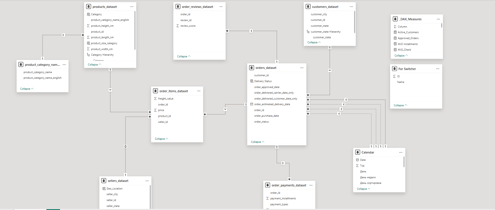

# Data Model

## Schema Overview

The report uses a hybrid Star/Snowflake schema with two fact tables.

## Tables

| Table | Type | Description |
|---|---|---|
| `orders_dataset` | Fact | Core orders table with 5 date fields and order status |
| `order_items_dataset` | Fact | Line-item level: product, seller, price, freight |
| `customers_dataset` | Dimension | Customer location data |
| `sellers_dataset` | Dimension | Seller location data |
| `products_dataset` | Dimension | Product attributes + computed size category |
| `product_category_name` | Dimension | Portuguese → English category translation |
| `order_payments_dataset` | Dimension | Payment type and installment data |
| `order_reviews_dataset` | Dimension | Review scores linked to orders |
| `Calendar` | Dimension | Custom date table for time intelligence |
| `_DAX_Measures` | Measures | Centralised measures table (no data rows) |
| `For Switcher` | Helper | Field parameter table for dynamic metric switcher |

## Key Relationship Decisions

- **Five date fields on orders_dataset:** only `order_purchase_date` is the active relationship to Calendar. All other date fields (approved, carrier, estimated delivery, actual delivery) are connected via inactive relationships, activated in DAX using `USERELATIONSHIP` inside `CALCULATE`.
- **product_category_name as separate table:** kept isolated to avoid duplicating Portuguese category strings across all product rows (snowflake extension).
- **Measures table:** all DAX measures stored in a dedicated `_DAX_Measures` table to keep the model organised and measures easy to find.
